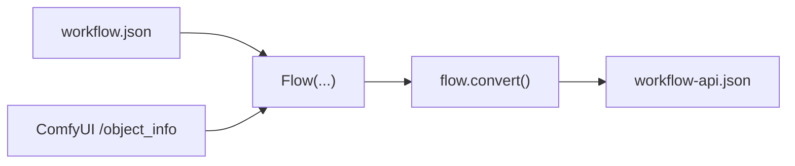
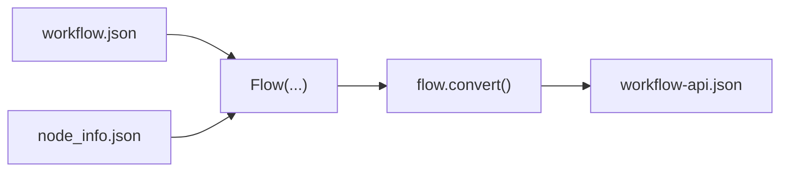

<!-- Keep version below in sync with autoflow/version.py -->
```text
ComfyUI 
 █████╗ ██╗   ██╗████████╗ ██████╗ ███████╗██╗      ██████╗ ██╗    ██╗
██╔══██╗██║   ██║╚══██╔══╝██╔═══██╗██╔════╝██║     ██╔═══██╗██║    ██║
███████║██║   ██║   ██║   ██║   ██║█████╗  ██║     ██║   ██║██║ █╗ ██║
██╔══██║██║   ██║   ██║   ██║   ██║██╔══╝  ██║     ██║   ██║██║███╗██║
██║  ██║╚██████╔╝   ██║   ╚██████╔╝██║     ███████╗╚██████╔╝╚███╔███╔╝
╚═╝  ╚═╝ ╚═════╝    ╚═╝    ╚═════╝ ╚═╝     ╚══════╝ ╚═════╝  ╚══╝╚══╝ 
                                                       version: 1.4.0
```

[](https://pypi.org/project/comfyui-autoflow/)
[](https://pypi.org/project/comfyui-autoflow/)
[](https://github.com/chrisdreid/comfyui-autoflow/blob/main/LICENSE)
[](https://github.com/chrisdreid/comfyui-autoflow)
[](https://github.com/chrisdreid/comfyui-autoflow/issues)
[](https://pypi.org/project/comfyui-autoflow/)

---

# Imagine...

### What if you could `load, edit, and submit` ComfyUI workflows without ever exporting an API workflow from the GUI?

### What if you could `batch-convert and patch workflows offline` — no running ComfyUI instance required?

### What if you could `render` ComfyUI workflows and `collect every output file` — all from a Python script or the command line?

- # Let me introduce `comfyui-autoflow`

---

# autoflow

Skip the GUI export step. Load your `workflow.json`, edit it, submit it, and collect the results — autoflow handles the conversion behind the scenes.

Pure **Python** (stdlib-only, zero dependencies). Works with or without a running ComfyUI server.

---

## Installation

```bash
pip install comfyui-autoflow
```

Use as `import autoflow` in Python, or `python -m autoflow` from the command line.

Set these environment variables once and every example below gets shorter:

```bash
export AUTOFLOW_COMFYUI_SERVER_URL="http://localhost:8188"
export AUTOFLOW_NODE_INFO_SOURCE="/path/to/node_info.json"   # or: modules | fetch | server
```

- More: [`docs/node-info-and-env.md`](docs/node-info-and-env.md)

---

# Convert: `workflow.json` → API Payload

Every ComfyUI workflow you save from the GUI is a **workspace** file (`workflow.json`). To render, ComfyUI needs an **API payload** — the stripped-down node graph it actually executes. Normally you'd have to export this manually from the GUI. autoflow does it for you.

## Convert with a running ComfyUI server

Load your `workflow.json` as a `Flow`, convert it, and save the API payload. autoflow fetches the node definitions it needs from your running server.



```python
from autoflow import Flow

flow = Flow("workflow.json", server_url="http://localhost:8188")
api = flow.convert()
api.save("workflow-api.json")
```

```bash
python -m autoflow -i workflow.json -o workflow-api.json --server-url http://localhost:8188
```

## Convert offline (no server needed)

Save `node_info.json` once from your ComfyUI instance, then convert anywhere — no server required.



```python
from autoflow import Flow

flow = Flow("workflow.json", node_info="node_info.json")
api = flow.convert()
api.save("workflow-api.json")
```

```bash
python -m autoflow -i workflow.json -o workflow-api.json -f node_info.json
```

### Get `node_info.json` (one-time setup)

```python
from autoflow import NodeInfo

NodeInfo.fetch(server_url="http://localhost:8188", output_path="node_info.json")
```

```bash
python -m autoflow --download-node-info-path node_info.json --server-url http://localhost:8188
```

- More: [`docs/convert.md`](docs/convert.md), [`docs/node-info-and-env.md`](docs/node-info-and-env.md)

---

# Edit, Submit, and Collect Files

This is the full workflow most users want: load your `workflow.json`, tweak it, submit to ComfyUI, track progress, and save the output files. You never need to manually convert — `Flow.submit()` handles conversion internally.


## Edit + Submit + Save (complete example)

```python
from autoflow import Flow, ProgressPrinter

flow = Flow("workflow.json", server_url="http://localhost:8188")

# edit any node input with dot syntax
flow.nodes.KSampler.seed = 42
flow.nodes.KSampler.steps = 30
flow.nodes.CheckpointLoaderSimple.ckpt_name = "sd_xl_base_1.0.safetensors"
flow.nodes.SaveImage.filename_prefix = "autoflow"

# submit with live progress — converts internally, no manual conversion needed
res = flow.submit(wait=True, on_event=ProgressPrinter())

# collect and save output images
images = res.fetch_images()
images.save("outputs/frame.###.png")
```

```bash
python -m autoflow --submit -i workflow.json --server-url http://localhost:8188 \
  --save-images outputs --filepattern "frame.###.png"
```

- More: [`docs/submit-and-images.md`](docs/submit-and-images.md), [`docs/progress-events.md`](docs/progress-events.md)

## Submit without waiting

Fire-and-forget — get a `prompt_id` handle back immediately.

```python
from autoflow import Flow

flow = Flow("workflow.json", server_url="http://localhost:8188")
res = flow.submit(wait=False)
print(res.prompt_id)
```

```bash
python -m autoflow --submit -i workflow.json --server-url http://localhost:8188 --no-wait
```

## Progress events

Hook into ComfyUI's WebSocket to track rendering in real time.


```python
from autoflow import Flow, ProgressPrinter, chain_callbacks

def my_logger(event):
    if event.type == "progress":
        print(f"Step {event.data['value']}/{event.data['max']}")

flow = Flow("workflow.json", server_url="http://localhost:8188")
flow.submit(
    wait=True,
    on_event=chain_callbacks(ProgressPrinter(), my_logger),
)
```

- More: [`docs/progress-events.md`](docs/progress-events.md)

## Collecting output files

Fetch images, files, or any registered output from ComfyUI after a render.

```python
from autoflow import Flow

flow = Flow("workflow.json", server_url="http://localhost:8188")
res = flow.submit(wait=True)

# fetch and save images
images = res.fetch_images()
images.save("outputs/frame.###.png")                       # frame.000.png, frame.001.png, ...
images.save("outputs/frame.####.png", index_offset=1001)   # frame.1001.png, frame.1002.png, ...
images.save("outputs/", filename="render.{src_frame}.png") # carry ComfyUI's original frame number

# fetch all registered files (images, videos, audio, etc.)
files = res.fetch_files(output_types=["images", "files"])
files.save("outputs/")
```

```bash
# save images with pattern
python -m autoflow --submit -i workflow.json --server-url http://localhost:8188 \
  --save-images outputs --filepattern "frame.###.png" --index-offset 1001

# save all registered output files
python -m autoflow --submit -i workflow.json --server-url http://localhost:8188 \
  --save-files outputs --output-types images,files
```

- More: [`docs/submit-and-images.md`](docs/submit-and-images.md)

---

# ApiFlow (direct API payload access)

If you already have a `workflow-api.json` (exported from the GUI or previously converted), or you want to work directly with the API payload format, use `ApiFlow`. It also auto-detects workspace files and converts them.

```python
from autoflow import ApiFlow

# load an existing API payload
api = ApiFlow.load("workflow-api.json")

# or auto-convert from workspace (same as Flow + convert)
api = ApiFlow("workflow.json", node_info="node_info.json")

# edit — ApiFlow uses direct attribute access (no .nodes prefix)
api.KSampler.seed = 42
api.KSampler.steps = 30

# submit
res = api.submit(server_url="http://localhost:8188", wait=True)
images = res.fetch_images()
images.save("outputs/frame.###.png")
```

- More: [`docs/load-vs-convert.md`](docs/load-vs-convert.md)

---

# Features

## Edit nodes with dot syntax

Access and modify any node input like a Python attribute — no JSON key hunting.

```python
# Flow (workspace) — access via .nodes
flow.nodes.KSampler.seed = 42
flow.nodes.EmptyLatentImage.width = 1024
flow.nodes.CheckpointLoaderSimple.ckpt_name = "sd_xl_base_1.0.safetensors"

# ApiFlow (API payload) — direct access
api.KSampler.seed = 42
api.EmptyLatentImage.width = 1024
```

## Find and target nodes

Search by type, title, or any attribute. Get stable addresses for subgraph nodes.

```python
# search by type
samplers = flow.nodes.find(type="KSampler")
samplers[0].seed = 42

# find subgraph nodes
sg = flow.nodes.find(title="MySubgraph")[0]
print(sg.path())  # "18:17:3"

# ApiFlow path-style access
api["ksampler/seed"] = 42
api["18:17:3/seed"] = 42   # subgraph node IDs
```

- More: [`docs/convert.md`](docs/convert.md)

## Widget introspection

Query valid options, help text, and raw specs directly from `node_info`.

```python
flow.nodes.CheckpointLoaderSimple.ckpt_name.choices()   # list of available checkpoints
flow.nodes.KSampler.sampler_name.choices()               # ["euler", "euler_ancestral", ...]
flow.nodes.KSampler.seed.tooltip()                       # help text
flow.nodes.KSampler.seed.spec()                          # raw node_info spec
```

## Mapping for pipelines

Patch seeds, prompts, and file paths across nodes in batch — built for render farms and production pipelines.

```python
from autoflow import api_mapping, map_strings

api = flow.convert()

# callback-based mapping
api_mapping(api, seed=lambda: random.randint(0, 2**32))

# declarative string mapping
map_strings(api, {"positive_prompt": "a photo of a cat", "negative_prompt": "blurry"})
```

- More: [`docs/mapping.md`](docs/mapping.md), [`docs/map-strings-and-paths.md`](docs/map-strings-and-paths.md)

## Extract workflows from PNG

ComfyUI embeds workflow metadata in its PNG outputs. Load directly — no extra dependencies.

```python
from autoflow import Flow, ApiFlow

flow = Flow("ComfyUI_00001_.png")          # extracts workspace
api = ApiFlow.load("ComfyUI_00001_.png")   # extracts API payload
```

- More: [`docs/load-vs-convert.md`](docs/load-vs-convert.md)

## Subgraphs (nested workflow components)

Workflows with `definitions.subgraphs` are flattened automatically during conversion — no special handling needed.

- More: [`docs/convert.md`](docs/convert.md)

## Offline or online

Convert without a server using saved `node_info.json`, or fetch live from a running ComfyUI instance. Network access is always explicit — no surprise server calls.

- More: [`docs/node-info-and-env.md`](docs/node-info-and-env.md)

## Serverless execution

Run workflows end-to-end inside a ComfyUI environment without starting the HTTP server.

```python
flow = Flow("workflow.json", node_info="modules")
result = flow.execute()
```

- More: [`docs/execute.md`](docs/execute.md)

## Force recompute / cache-busting

Ensure repeat runs actually re-execute instead of hitting ComfyUI's cache.

- More: [`docs/force-recompute.md`](docs/force-recompute.md)

## Service-ready

Structured errors with partial results for API-friendly responses, plus FastAPI integration patterns.

- More: [`docs/error-handling.md`](docs/error-handling.md), [`docs/fastapi.md`](docs/fastapi.md)

## Stdlib-only

No dependencies by default. Optional Pillow for image transcoding, ImageMagick / ffmpeg for advanced format conversions.

- More: [`docs/submit-and-images.md`](docs/submit-and-images.md)

---

## Requirements

- Python 3.7+
- ComfyUI server (optional — only needed for submission and live conversion)
- No additional Python packages required

### Tested ComfyUI Versions
- ComfyUI `0.8.2`
- ComfyUI_frontend `v1.35.9`

---

## CLI Reference

| Argument | Short | Description |
|----------|-------|-------------|
| `--input-path` | `-i` | Input workflow JSON file path |
| `--output-path` | `-o` | Output API format JSON file path |
| `--server-url` | | ComfyUI server URL (or set `AUTOFLOW_COMFYUI_SERVER_URL`) |
| `--node-info-path` | `-f` | Path to saved `node_info.json` file |
| `--download-node-info-path` | | Download `/object_info` and save to file |
| `--submit` | | Submit converted API payload to ComfyUI |
| `--no-wait` | | Submit without waiting for completion (prints `prompt_id` and exits) |
| `--no-progress` | | Disable progress output during `--submit` when waiting |
| `--save-images` | | Directory to save fetched images (requires waiting) |
| `--filepattern` | | Filename pattern used when saving images (default: `frame.###.png`) |
| `--index-offset` | | Index offset for `#` patterns (default: 0) |
| `--save-files` | | Directory to save fetched registered files (requires waiting) |
| `--output-types` | | Comma-separated registered output types when saving files (e.g. `images,files`) |

---

## Contributing

Key design principles:

- **Minimal Dependencies**: Uses only Python standard library
- **Cross-Platform**: Works on Linux, Windows, and macOS
- **Exact Replication**: Matches ComfyUI's internal conversion exactly

### Running tests

```bash
# Full test suite (154 tests, offline, no server needed)
python examples/unittests/main.py --non-interactive --no-browser

# Legacy unittest discovery
python -m unittest discover -s examples/unittests -v

# Docs examples test harness
python examples/code/docs-test.py --mode offline --exec-python --run-cli
```

- More: [`docs/contributing-tests.md`](docs/contributing-tests.md)

## License

[`MIT License`](LICENSE)

## Related

- [ComfyUI](https://github.com/comfyanonymous/ComfyUI) — The main ComfyUI project
- [ComfyUI API Documentation](https://github.com/comfyanonymous/ComfyUI/wiki/API) — API format specification
