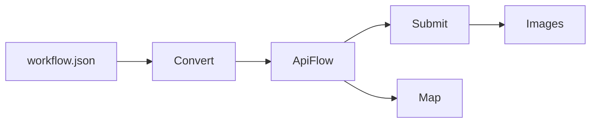

## Advanced topics

This file is intentionally **not** a docs index.

Use it when you want:
- deeper details
- more options
- service-style integration patterns



## Image saving + transcoding
- Save patterns and overwrite controls:
  - `images.save("outputs")`
  - `images.save("outputs/frame.###.png")`
  - default output dir: set env `AUTOFLOW_OUTPUT_PATH` and call `images.save(filename="frame.###.png")`
  - more: [`submit-and-images.md`](submit-and-images.md)
- Optional transcode helpers:
  - Pillow (optional): save JPEG/WebP/etc
  - ImageMagick / ffmpeg (optional): helper paths and conversions

## Repeatability (pipelines)
- Avoid cached results on repeated runs:
  - more: [`force-recompute.md`](force-recompute.md)

## Service integration patterns
- Prefer structured results over exceptions:
  - `Flow.convert_with_errors(...)` → `ConvertResult`
  - more: [`error-handling.md`](error-handling.md)
- FastAPI wiring patterns:
  - more: [`fastapi.md`](fastapi.md)

## PNG extraction (recover workflows)
- Extract workflow metadata from ComfyUI PNG outputs:
  - `ApiFlow.load("output.png")` → API payload
  - `Flow.load("output.png")` → workspace
  - Works with file paths or raw bytes
  - No external dependencies (stdlib-only)
  - more: [`load-vs-convert.md`](load-vs-convert.md)

## OOP node access
- Attribute-style access by class_type:
  - `api.ksampler[0].seed = 42`
  - `api.ksampler[0]._meta` / `.meta`
- Path-style access: `api["ksampler/seed"]`
- Workspace nodes via `.nodes`: `flow.nodes.ksampler[0].type`
- Schema-aware drilling for workspace widgets (requires `object_info`):
  - `flow = Flow("workflow.json", object_info="object_info.json")`
  - `flow.nodes.KSampler[0].seed`  # maps `widgets_values` list to names using object_info
- Explore available keys/widgets:
  - `flow.nodes.KSampler[0].attrs()`
  - `flow.nodes.KSampler.attrs()`  # group: uses first node
- Nested dict drilling: `flow.extra.ds.scale = 0.5`
- List drilling:
  - If a value is a list (e.g. `node.properties.models`), it’s wrapped as `ListView`.
  - If the list has exactly 1 dict item, `models.url` delegates to `models[0].url`.
  - Otherwise, index first: `models[0].url`
- All views castable: `dict(api.ksampler[0])`, `list(api.ksampler)`
- more: [`load-vs-convert.md`](load-vs-convert.md)

## Dependency graph (DAG)

Both `Flow` (workspace) and `ApiFlow` (API payload) expose a best-effort dependency graph derived from links/inputs:

```python
from autoflow import Flow, ApiFlow

flow = Flow("workflow.json")
dag = flow.dag
print(dag.nodes)          # node ids
print(dag.edges)          # (src, dst) edges
print(dag.deps("3"))      # immediate deps
print(dag.ancestors("9")) # transitive deps

api = ApiFlow("workflow-api.json")
print(api.dag.cls)  # "ApiFlow" (or "Flow" for workspace DAGs)
print(api.dag.to_dot(label="class_type"))
print(api.dag.to_mermaid(label="class_type"))
print(api.dag.nodes.toposort())
print(api.dag.entities.toposort())

# For visualization in dependency order:
print(api.dag.toposort().to_mermaid())
```

Notes:
- DAG order is stable but may not match runtime execution order.
- `dag.nodes.toposort()` is best-effort; if a cycle exists, it falls back to original node order.

## Finding nodes (and printing their address)

If you renamed a subgraph in the GUI, you can find it by title and still print a stable path for debugging/copy/paste.

```python
from autoflow import Flow, ApiFlow

# Workspace flow (supports nested subgraphs; deep=True by default)
flow = Flow("workflow.json")
node = flow.nodes.find(title="NewSubgraphName")[0]
print(node.path())  # e.g. "18" or "18:17:3" for nested subgraphs
# (alias: node.address())

# API payload (ComfyUI export already flattens subgraphs; IDs keep the subgraph path)
api = ApiFlow("workflow-api.json")
ks = api.find(class_type="KSampler")[0]
print(ks.path())    # e.g. "18:17:3"
ks.seed = 123
```

### Attribute-based find (Flow + ApiFlow)
Both `Flow.find(...)` / `flow.nodes.find(...)` and `ApiFlow.find(...)` support deep key/value searching.

- **Key/value filters**: `key=value` (AND by default)
- **Existence filter**: `key="*"` means “key exists anywhere”
- **Operator**: `operator="or"` (or `operator_mode="or"`)
- **Depth**: `depth=` controls both nested subgraphs (when `deep=True`) and nested dict/list recursion
- **Regex**:
  - `type=` / `class_type=` / `title=` can be a `re.Pattern`
  - `key=` values can also be a `re.Pattern`

Examples:

```python
import re
from autoflow import Flow

flow = Flow("workflow.json", object_info="object_info.json")

# Find by type, then update a widget value (schema-aware when object_info is attached)
ksamplers = flow.nodes.find(type="KSampler")
if not ksamplers:
    raise RuntimeError("No KSampler nodes found in workflow.json")
ks = ksamplers[0]
ks.seed = 123  # writes back into widgets_values

# Find by key existence
with_cnr = flow.find(cnr_id="*", depth=8)

# Regex type match
only_k = flow.nodes.find(type=re.compile(r"^K.*", re.IGNORECASE))

# Regex value match
same_seed = flow.find(seed=re.compile(r"^123$"), depth=8)
```

## Debugging
- Common file-shape mistakes (workspace vs API payload):
  - more: [`load-vs-convert.md`](load-vs-convert.md)
- Common runtime issues:
  - more: [`troubleshooting.md`](troubleshooting.md)

## Deprecated / experimental switches
- `AUTOFLOW_MODEL_LAYER` (internal): switches between model implementations for local testing.
  - more: [`object-info-and-env.md`](object-info-and-env.md)
