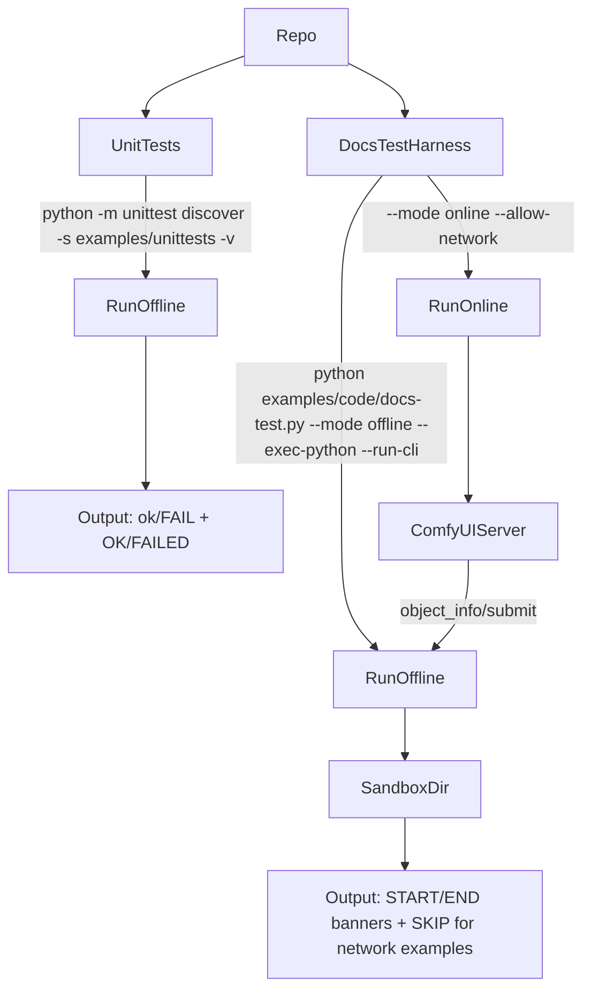

# Contributing flow

```mermaid
flowchart TD
  repo[Repo] --> unit[UnitTests]
  repo --> docs[DocsTestHarness]

  unit -->|"python -m unittest discover -s examples/unittests -v"| unitRun[RunOffline]
  unitRun --> unitOut["Output: ok/FAIL + OK/FAILED"]

  docs -->|"python examples/code/docs-test.py --mode offline --exec-python --run-cli"| docsRun[RunOffline]
  docsRun --> docsSandbox[SandboxDir]
  docsSandbox --> docsOut["Output: START/END banners + SKIP for network examples"]

  docs -->|"--mode online --allow-network"| docsOnline[RunOnline]
  docsOnline --> comfyServer[ComfyUIServer]
  comfyServer -->|"object_info/submit"| docsRun
```

