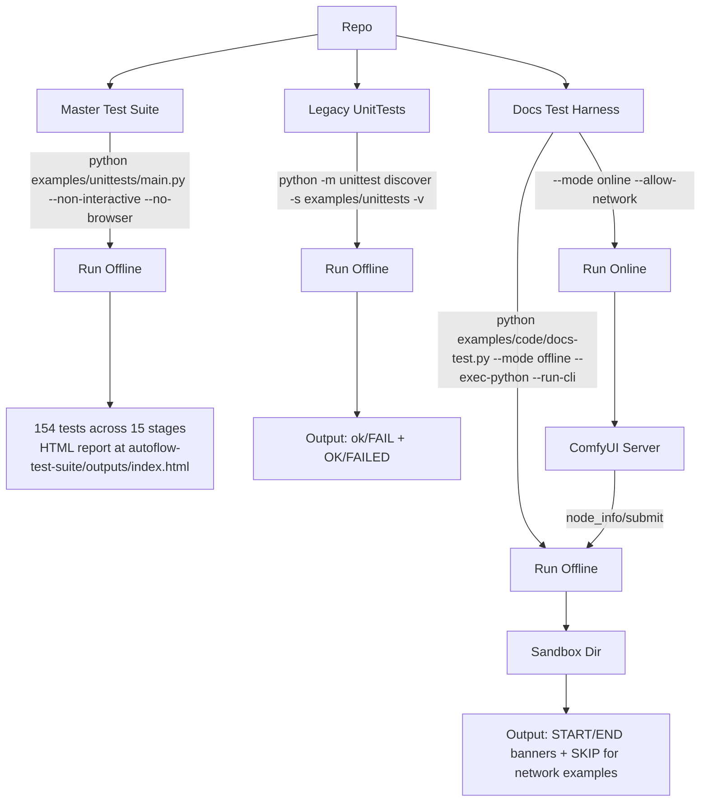

# Contributing: Tests

## Test Architecture



## Test Stages

| Stage | Area | Tests | Requires |
|-------|------|-------|----------|
| 0 | Imports & basics | ~10 | — |
| 1 | NodeInfo schema | ~8 | — |
| 2 | Conversion | ~12 | — |
| 3 | API payload access | ~15 | — |
| 4 | Mapping helpers | ~10 | — |
| 5 | Fixtures (server) | varies | `--fixtures-dir` |
| 6 | Server submission | varies | `--server-url` |
| 7 | Tools (PIL, etc.) | ~1 | Pillow |
| 8 | Flow core API | 20 | — |
| 9 | FlowNodeProxy / NodeRef | 15 | — |
| 10 | NodeSet / FlowNodeGroup | 12 | — |
| 11 | WidgetValue | 15 | — |
| 12 | ApiFlow + NodeProxy | 12 | — |
| 13 | NodeInfo | 8 | — |
| 14 | DictView / ListView | 10 | — |
| 15 | Workflow factory | 4 | — |

## Running

```bash
# Full suite (offline)
python examples/unittests/main.py --non-interactive --no-browser

# Single stage
python examples/unittests/main.py --stage 8 --non-interactive --no-browser

# With server tests
python examples/unittests/main.py --server-url http://localhost:8188 --non-interactive --no-browser
```
