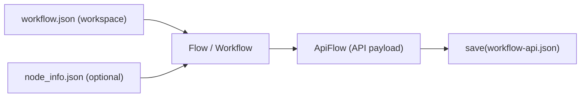
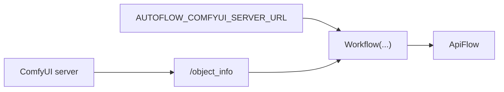
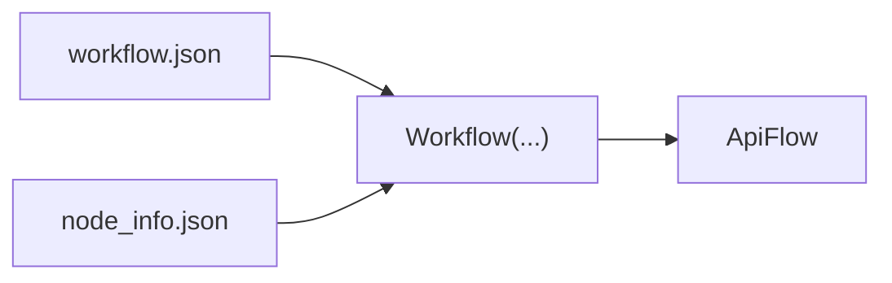

# Convert (workflow.json → workflow-api.json)

autoflow takes a ComfyUI **workspace** `workflow.json` and converts it into a ComfyUI **API payload** (the renderable blueprint, often called `workflow-api.json`).



## Subgraphs

If your workspace `workflow.json` uses ComfyUI **subgraphs** (`definitions.subgraphs` with UUID-typed nodes), autoflow will **inline/flatten** them during conversion so the resulting API payload contains only real ComfyUI node `class_type`s.

## Reading + writing values in subgraphs

ComfyUI subgraphs are a **workspace** feature. The **API payload does not contain subgraphs**; ComfyUI exports API payloads by flattening subgraphs into normal nodes (often using node IDs like `18:17:3` to preserve the subgraph path).

autoflow mirrors this:
- Convert-time: workspace subgraphs are flattened so your `ApiFlow` is always a normal API payload.
- Editing time: you can still navigate and update subgraph nodes using the workspace `Flow` (before converting), or using the flattened API node IDs / search helpers (after converting).

### Option A: edit the workspace Flow (before converting)

Use `Flow` when you want to locate nodes by subgraph title/type and update values in-place before conversion:

```python
from autoflow import Flow

flow = Flow.load("workflow.json")

# Find a renamed subgraph instance by GUI title (deep=True by default)
sg = flow.nodes.find(title="NewSubgraphName")[0]
print(sg.path())  # e.g. "18" or "18:17:3"

# Find a node inside nested subgraphs by type and update its widgets_values
ksamplers = flow.find(type="KSampler")
ksamplers[0].widgets_values[0] = 123  # seed (workspace uses widgets_values list)
```

### Option B: edit the API payload (after converting)

In an `ApiFlow`, subgraphs are already flattened. You can edit by node type, by node id/path, or by searching:

```python
from autoflow import Workflow, ApiFlow

# Convert workspace → API payload
api = Workflow("workflow.json", node_info="node_info.json")

# Find and edit nodes by class_type
api.find(class_type="KSampler")[0].seed = 123

# If the API payload came from a subgraph export, node IDs may include the subgraph chain:
# e.g. "18:17:3" (outer subgraph node 18, inner 17, node 3)
api2 = ApiFlow.load("workflow-api.json")
api2["18:17:3/seed"] = 123
```

## Live conversion (fetch `/object_info`)

Convert `workflow.json` by fetching schema from a running ComfyUI server.



```python
# api
import os
from autoflow import Workflow

os.environ["AUTOFLOW_COMFYUI_SERVER_URL"] = "http://localhost:8188"
api = Workflow("workflow.json")
api.save("workflow-api.json")
```

```bash
# cli
export AUTOFLOW_COMFYUI_SERVER_URL="http://localhost:8188"
python -m autoflow --input-path workflow.json --output-path workflow-api.json
```

## Direct module conversion (no server)

If you're running inside a ComfyUI environment (repo + venv), you can convert using local node modules:

**Environment note**: this requires ComfyUI’s Python modules to be importable (same venv/conda env you run ComfyUI with, and ComfyUI repo root on `PYTHONPATH` or as your working directory).

Related:
- Serverless execution (no ComfyUI HTTP server): [`execute.md`](execute.md)

```python
# api
from autoflow import Workflow

api = Workflow("workflow.json", node_info="modules")
api.save("workflow-api.json")
```

You can also set `AUTOFLOW_NODE_INFO_SOURCE=modules` to auto-resolve `node_info` when omitted.

## Offline conversion (saved `node_info.json`)

Convert `workflow.json` using a saved `node_info.json` (reproducible; no server needed).



```python
# api
from autoflow import Workflow

api = Workflow("workflow.json", node_info="node_info.json")
api.save("workflow-api.json")
```

```bash
# cli
python -m autoflow --input-path workflow.json --output-path workflow-api.json --node-info-path node_info.json
```

## Strict loading (when you want control)

If you want to edit a workspace flow before converting:


```python
# api
from autoflow import Flow

flow = Flow.load("workflow.json")      # strict workspace loader
# ... edit flow dict ...
api = flow.convert(node_info="node_info.json")
```

```bash
# CLI note: strict Flow.load(...) editing is Python-only.
```


