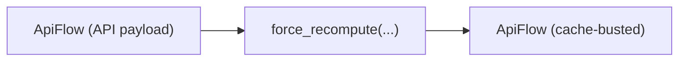

# Force recompute (force_recompute)

Use this when you want repeated runs to avoid reusing cached results.



## What it does
- Adds a random UUID to `inputs` for selected node types
- Default behavior is opt-in:
  - `use_defaults=False` does nothing
  - `use_defaults=True` uses a small conservative list (e.g. `KSampler`)

```python
# api
from autoflow import Workflow
from autoflow.map import force_recompute

api = Workflow("workflow.json", object_info="object_info.json")
api2 = force_recompute(api, use_defaults=True)
```

## CLI
- CLI note: `force_recompute(...)` is currently Python-only.

```bash
# Use Python to apply force_recompute before save/submit.
```


