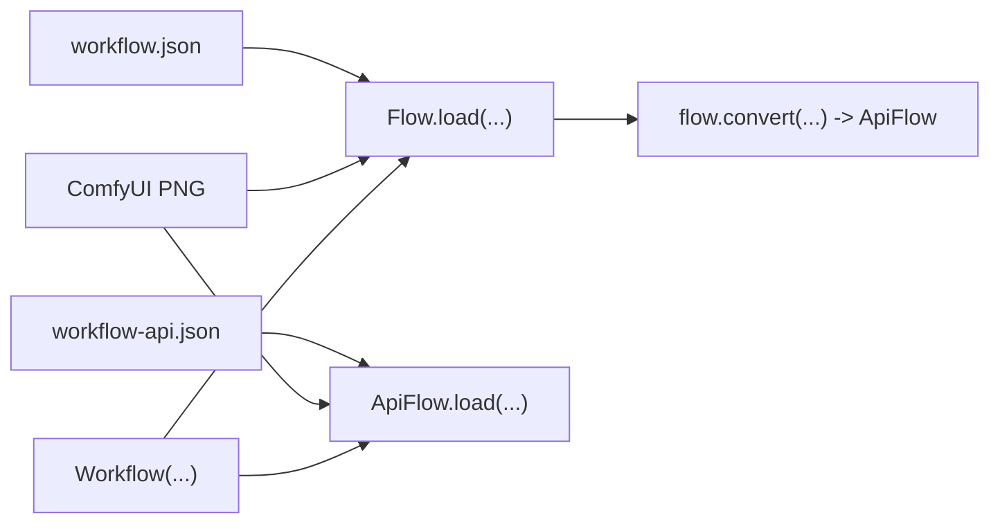

# Load vs convert (Flow / ApiFlow / Workflow)

Use the right entry point based on what you have.

**`ApiFlow`** = the API payload (renderable blueprint for ComfyUI).



## Polymorphic Loading

All `.load()` methods accept multiple input types:

| Input | Description |
|-------|-------------|
| `dict` | Already-parsed JSON, used directly |
| `bytes` | PNG bytes (extracts metadata) or JSON bytes |
| `str` (JSON) | JSON string (detected by `{`, `}`, `:`) |
| `str` (path) | File path to `.json` or `.png` |
| `Path` | pathlib.Path to `.json` or `.png` |

## Quick rules
- **Have `workflow.json` (workspace)**:
  - use `Flow.load(...)` (strict) if you want to inspect/edit first
  - use `Workflow(...)` (convenience) if you just want an `ApiFlow`
- **Have `workflow-api.json` (API payload)**:
  - use `ApiFlow.load(...)` (strict)
  - or use `Workflow(...)` (auto-detect)
- **Have a ComfyUI PNG output**:
  - use `ApiFlow.load("image.png")` to extract the API payload
  - use `Flow.load("image.png")` to extract the workspace

## Workspace: `Flow` (strict)
- Must contain:
  - `nodes` (list)
  - `links` (list)
  - `last_node_id`
  - `last_link_id`

```python
# api
from autoflow import Flow

flow = Flow.load("workflow.json")
api = flow.convert(object_info="object_info.json")
api.save("workflow-api.json")
```

## API payload: `ApiFlow` (strict)
- Must be a dict-of-nodes:
  - each node has `class_type` and `inputs`

```python
# api
from autoflow import ApiFlow

api = ApiFlow.load("workflow-api.json")
```

## Wrapper: `Workflow` (auto-detect)
- If input looks like a workspace flow:
  - returns `ApiFlow` (default `auto_convert=True`)
  - or returns `Flow` (if `auto_convert=False`)
- If input looks like an API payload:
  - returns `ApiFlow`

```python
# api
from autoflow import Workflow

api = Workflow("workflow.json", object_info="object_info.json")
api2 = Workflow("workflow-api.json")
```

## PNG Loading (extract embedded workflow)

ComfyUI embeds workflow metadata in PNG outputs. Extract directly:

```python
# api
from autoflow import Flow, ApiFlow

# From PNG file
api_flow = ApiFlow.load("ComfyUI_00001_.png")  # extracts 'prompt' (API payload)
flow = Flow.load("ComfyUI_00001_.png")          # extracts 'workflow' (workspace)

# From bytes (HTTP upload, database, etc.)
with open("output.png", "rb") as f:
    png_bytes = f.read()
api_flow = ApiFlow.load(png_bytes)
```

## OOP Node Access

Access and modify nodes using clean attribute and path syntax:

```python
# api
from autoflow import ApiFlow

api = ApiFlow.load("workflow-api.json")

# By class_type (case-insensitive)
api.ksampler[0].seed = 42           # first KSampler
# Optional second KSampler (only if present)
if len(api.ksampler) > 1:
    api.ksampler[1].seed = 123
api.KSampler[0].steps = 20          # original case works too

# Path syntax
api["ksampler/seed"] = 42           # first ksampler's seed
api["ksampler/0/seed"] = 42         # explicit index
# By node ID (use an ID that actually exists in this payload)
node_id = api.find(class_type="KSampler")[0].id
api[f"{node_id}/seed"] = 42

# Iteration
for node in api.ksampler:
    print(node.id, node.seed)

# Read values
seed = api.ksampler[0].seed
steps = api["ksampler/steps"]

# Metadata access (both work)
api.ksampler[0]._meta              # returns DictView (empty {} if missing)
api.ksampler[0].meta               # same
api.ksampler[0].meta.title = "My Sampler"  # set metadata
```

For `Flow` (workspace format), access nodes via `.nodes` to avoid conflicts with top-level keys:

```python
# api
from autoflow import Flow
flow = Flow.load("workflow.json")

# Access nodes via .nodes
flow.nodes.ksampler[0].type        # "KSampler"
flow.nodes.ksampler[0].id          # node ID
flow.nodes[0].type                 # first node by index

# Top-level keys work as expected
flow.links                         # links array
flow.extra                         # extra metadata (DictView)
flow.extra.ds.scale                # drill into nested dicts
flow.extra.ds.scale = 0.5          # modify (propagates to original)
flow["last_node_id"]               # dict access still works
```

For `ObjectInfo`, path access navigates the schema:

```python
# api
from autoflow import ObjectInfo
obj = ObjectInfo.load("object_info.json")
obj["KSampler/input/required/seed"]  # get seed input spec
```

All proxy objects support conversion back to plain dicts/lists:

```python
from autoflow import Flow, ApiFlow

api = ApiFlow.load("workflow-api.json")
flow = Flow.load("workflow.json")

# Single node → dict
dict(api.ksampler[0])              # or .to_dict()

# Node group → dict/list
api.ksampler.to_dict()             # {node_id: node, ...}
api.ksampler.to_list()             # [node, ...]

# Flow nodes
flow.nodes.to_dict()               # {id: node, ...}
flow.nodes.to_list()               # [node, ...]
```

## CLI
- CLI only converts workspace `workflow.json` → `workflow-api.json`

```bash
# cli
python -m autoflow --input-path workflow.json --output-path workflow-api.json --object-info-path object_info.json
```
