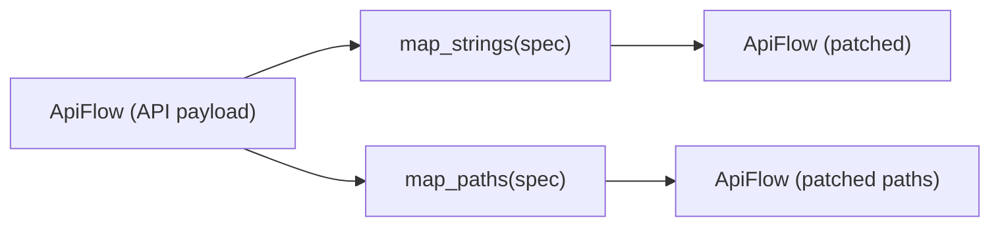

# Declarative mapping (map_strings / map_paths)

Use declarative mapping when you want a JSON-friendly spec to patch string/path inputs.



## map_strings(flow, spec)
- Rewrites **string values** under each node `inputs`
- `spec` supports:
  - literal replacements (ordered)
  - regex replacements (list)
  - optional rules to target specific nodes/params/values
- Rules expand env vars and can be inline regex or **a file path** to a regex

```python
# api
from autoflow import Workflow
from autoflow.map import map_strings

api = Workflow("workflow.json", object_info="object_info.json")

spec = {
    "replacements": {
        "literal": {"${ROOT}": "/data/project"},
        "regex": [{"pattern": r"\\{FRAME\\}", "replace": "0001"}],
    },
    "rules": {
        "mode": "and",
        "node": {"regex": r"LoadImage|SaveImage"},
        "param": {"regex": r"path|filename|image"},
    },
}

api2 = map_strings(api, spec)
```

## map_paths(flow, spec)
- Convenience wrapper around `map_strings(...)`
- Adds a conservative default `rules.param` filter (path-like keys)

```python
# api
from autoflow.map import map_paths

from autoflow import Workflow

api = Workflow("workflow.json", object_info="object_info.json")
spec = {
    "replacements": {
        "literal": {"${ROOT}": "/data/project"},
    },
}
api2 = map_paths(api, spec)
```

## CLI
- CLI note: mapping helpers are currently Python-only.

```bash
# Put your spec in JSON, then load + apply it in Python.
```


