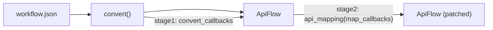
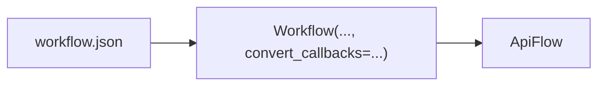
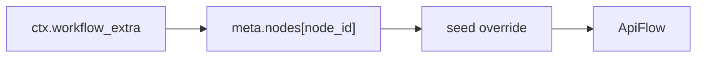
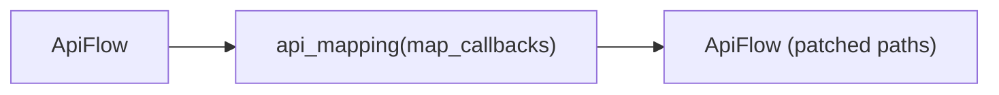

# Mapping (convert callbacks + api_mapping)

Mapping is how you patch/override values in an `ApiFlow` for pipelines (seeds, paths, prompts, etc).

Two stages:
- **Stage 1**: `convert_callbacks` (runs right after conversion)
- **Stage 2**: `api_mapping(api, map_callbacks)` (post-process the API payload)



## Stage 1: randomize seeds on convert



```python
# api
import random
from autoflow import Workflow

rng = random.SystemRandom()

def random_seed(ctx):
    if ctx["param"] == "seed" and ctx["param_type"] == "INT":
        return rng.randrange(0, 2**31)
    return None

api = Workflow("workflow.json", node_info="node_info.json", convert_callbacks=random_seed)
```

## Metadata-driven targeting (workflow['extra'])

ComfyUI persists workflow metadata under `workflow["extra"]`. A simple pattern is:


```json
{
  "extra": {
    "meta": {
      "nodes": {
        "3": { "randomize-seed": true }
      }
    }
  }
}
```

Callback:



```python
# api
import random
from autoflow import Workflow

rng = random.SystemRandom()

def seed_from_meta(ctx):
    extra = ctx.get("workflow_extra") or {}
    nodes = ((extra.get("meta") or {}).get("nodes") or {})
    flags = nodes.get(str(ctx["node_id"])) or {}
    if flags.get("randomize-seed") and ctx["param"] == "seed" and ctx["param_type"] == "INT":
        return rng.randrange(0, 2**31)
    return None

api = Workflow("workflow.json", node_info="node_info.json", convert_callbacks=seed_from_meta)
```

## Per-node patch injection (extra.autoflow.meta.nodes + extra.meta.nodes)

Sometimes you want to **carry metadata or patch directives inside the workflow file** itself, and have those directives applied to the converted `ApiFlow` nodes.

autoflow supports this as an **opt-in** convert feature:

- Put node directives under either:
  - `workflow["extra"]["autoflow"]["meta"]["nodes"][node_id]` (preferred, explicit)
  - `workflow["extra"]["meta"]["nodes"][node_id]` (generic metadata path)
- By default, patches are applied automatically during conversion.\n+- To opt out (disable), pass `disable_autoflow_meta=True`

If both are present for the same node id, they are applied in this order:

1. `extra.meta.nodes`
2. `extra.autoflow.meta.nodes`
3. `extra.autoflow.nodes` (legacy alias)

### Example (merge mode default)

```json
{
  "extra": {
    "autoflow": {
      "meta": {
        "nodes": {
          "8": {
            "meta": { "tags": ["my-pipeline"], "note": "hello" },
            "properties": { "cnr_id": "comfy-core" }
          }
        }
      }
    }
  }
}
```

```python
from autoflow import Flow

api = Flow.load("workflow.json").convert(
    node_info="node_info.json",
    # disable_autoflow_meta=True,
)
print(api["8"]["meta"]["note"])  # "hello"
```

### Modes

Each `nodes[node_id]` directive can be either:

- **shorthand**: a dict to merge (defaults to `mode="merge"`)
- **explicit**: `{ "mode": "...", "data": {...} }`

Supported `mode` values:

- `merge` (default): deep-merge dicts; overwrite on conflicts; non-dict values replace
- `add`: deep-merge dicts but never overwrite existing keys
- `replace`: replace the entire node dict with `data` (advanced/power feature)

### Key-prefix operators (per-key mode overrides)

Inside a patch dict, you can prefix keys to control behavior for that key:

- `+key`: add-only (do not overwrite an existing key)
- `*key`: force overwrite/merge
- `&key`: deep-merge dicts (falls back to overwrite if not dicts)
- `-key` or `!key`: delete the key from the target node

## Stage 2: Windows → Linux path mapping



```python
# api
from autoflow import Workflow, api_mapping

def win_to_linux(ctx):
    v = ctx["value"]
    if not isinstance(v, str):
        return None
    s = v.replace("\\\\", "/")
    if s.startswith("Z:/"):
        s = "/mnt/z/" + s[3:]
    return s if s != v else None

api = Workflow("workflow.json", node_info="node_info.json")
api = api_mapping(api, win_to_linux)
```

## Related
- **Declarative mapping** (`map_strings` / `map_paths`): [`map-strings-and-paths.md`](map-strings-and-paths.md)
- **Force recompute** (`force_recompute`): [`force-recompute.md`](force-recompute.md)


