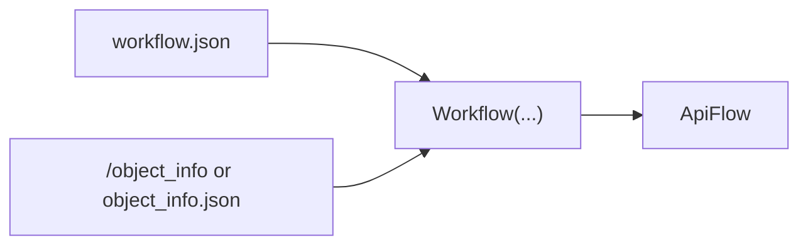

# ObjectInfo + env vars

`ObjectInfo` is the schema ComfyUI returns from `GET /object_info`. autoflow uses it to translate a workspace workflow into an API payload.

autoflow normalizes `object_info` inputs through a shared resolver, so you can pass:
- a dict-like `ObjectInfo` (including flowtree `ObjectInfo`)
- a file path
- a URL
- `"modules"` / `"from_comfyui_modules"` for direct module loading

Server URLs are normalized the same way: empty strings are treated as missing, and
`AUTOFLOW_COMFYUI_SERVER_URL` is used when server_url is omitted in conversion paths.

If `AUTOFLOW_OBJECT_INFO_SOURCE` is set, `ObjectInfo()`, `Flow`, `ApiFlow`, `Workflow`, and
conversion helpers will auto-resolve object_info when none is provided.

If it is **not** set, `ObjectInfo()` returns an **empty** object_info (no error), and you can
load/fetch later.



## Recommended: set server URL once

Set `AUTOFLOW_COMFYUI_SERVER_URL` once and `server_url` / `--server-url` become optional everywhere.


```bash
# cli
# Linux/macOS
export AUTOFLOW_COMFYUI_SERVER_URL="http://localhost:8188"

# Windows PowerShell
$env:AUTOFLOW_COMFYUI_SERVER_URL = "http://localhost:8188"

# Windows CMD
set AUTOFLOW_COMFYUI_SERVER_URL=http://localhost:8188
```

```python
# api
import os
os.environ["AUTOFLOW_COMFYUI_SERVER_URL"] = "http://localhost:8188"
```

## Fetch and save object_info.json

Save `object_info.json` for offline/reproducible conversion (no server needed later).


```python
# api
from autoflow import ObjectInfo

# Fetch from server and save
oi = ObjectInfo.fetch(server_url="http://localhost:8188", output_path="object_info.json")

# Or fetch then save separately
oi = ObjectInfo.fetch()
oi.save("object_info.json")
```

```bash
# cli
python -m autoflow --download-object-info-path object_info.json --server-url http://localhost:8188
```

## Load from file

```python
# api
from autoflow import ObjectInfo

oi = ObjectInfo.load("object_info.json")
```

## Load from ComfyUI modules (direct)

If you're running inside a ComfyUI environment (repo + venv), you can build an
`ObjectInfo` from local node modules without starting the server.

**Environment note**: this requires ComfyUI’s Python modules to be importable (same venv/conda env you run ComfyUI with, and ComfyUI repo root on `PYTHONPATH` or as your working directory).

Related:
- Serverless execution (no ComfyUI HTTP server): [`execute.md`](execute.md)

```python
# api
from autoflow import ObjectInfo

oi = ObjectInfo.from_comfyui_modules()
# or (equivalent explicit source)
oi = ObjectInfo("modules")
oi = ObjectInfo(source="modules")
```

## ObjectInfo API

| Method | Description |
|--------|-------------|
| `ObjectInfo.fetch(server_url=, timeout=, output_path=)` | Fetch from ComfyUI server |
| `ObjectInfo().fetch(server_url=, timeout=)` | Fetch and **mutate in-place** (returns `self`) |
| `ObjectInfo.load(path_or_json_str)` | Load from file or JSON string |
| `.save(path)` | Write to disk |
| `.to_json()` | Serialize to JSON string |

## Optional env vars (defaults)

These env vars override library defaults (precedence is always args → env → default):

| Env var | Type | Meaning |
|--------|------|---------|
| `AUTOFLOW_TIMEOUT_S` | int | Default HTTP timeout seconds |
| `AUTOFLOW_POLL_INTERVAL_S` | float | Poll interval for wait/poll loops |
| `AUTOFLOW_WAIT_TIMEOUT_S` | int | Default wait timeout seconds |
| `AUTOFLOW_SUBMIT_CLIENT_ID` | str | Default `client_id` for submit |
| `AUTOFLOW_SUBGRAPH_MAX_DEPTH` | int | Default max depth for subgraph flattening |
| `AUTOFLOW_FIND_MAX_DEPTH` | int | Default max depth for `flow.find(...)` / `flow.nodes.find(...)` recursion |
| `AUTOFLOW_OBJECT_INFO_SOURCE` | str | Source for `object_info`: `fetch`, `modules`, `server`, or a file path |

### AUTOFLOW_OBJECT_INFO_SOURCE

Supported values:
- `fetch`: Use `server_url` / `AUTOFLOW_COMFYUI_SERVER_URL` if set; otherwise fall back to modules.
- `modules`: Use local ComfyUI modules (`ObjectInfo.from_comfyui_modules()`).
- `server`: Require `server_url` / `AUTOFLOW_COMFYUI_SERVER_URL`; error if missing.
- any other value is treated as a file path to `object_info.json`.

Notes:
- Resolution is in-process only (no disk cache). `fetch` mode refreshes each call.

## Deprecated / experimental: model layer switch

autoflow currently supports an **internal** model implementation switch via an env var.

- This is **experimental** and may be removed before release.
- Only use it for local exploration/testing (don’t depend on it in production code).

**Env var**: `AUTOFLOW_MODEL_LAYER`

- `AUTOFLOW_MODEL_LAYER=flowtree` (default): wrapper-based, terminal-first navigation layer
- `AUTOFLOW_MODEL_LAYER=models`: legacy-parity dict-subclass layer

Set it **before importing** `autoflow`:

```bash
# Linux/macOS
export AUTOFLOW_MODEL_LAYER=models

# Windows PowerShell
$env:AUTOFLOW_MODEL_LAYER = "models"

# Windows CMD
set AUTOFLOW_MODEL_LAYER=models
```

