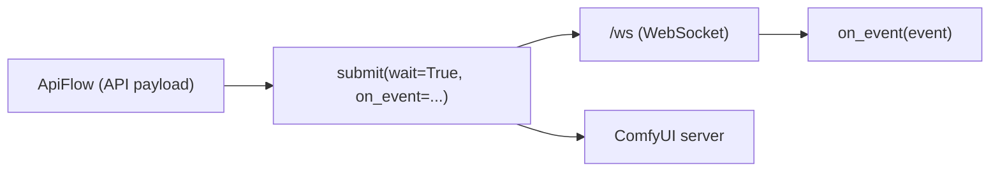
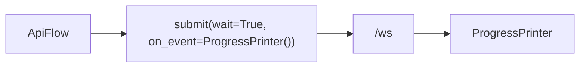
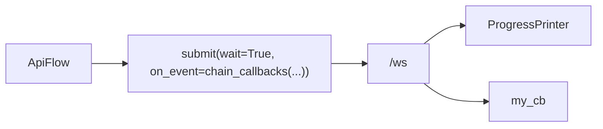

# Live progress events (WebSocket)

If you pass `wait=True` and `on_event=...`, autoflow opens ComfyUI’s WebSocket and streams events into your callback.



## Basic progress printer



## Completed events detected via history (WS silent / all-cached / queued)

Sometimes ComfyUI completes without producing a terminal websocket frame (common when everything is cached, or when you’re queued and the WS stays quiet).

In those cases, autoflow will probe `GET /history/<prompt_id>` and emit a **synthetic** terminal event:

- `type="completed"` (still a normal completed event)
- `detected_by="history"` (marker so you can tell it wasn’t a literal WS frame)
- `data` includes history-derived payload to make it feel like a real event:
  - `data["status"]` (including `completed`, `status_str`, `messages` when present)
  - `data["outputs"]` (output refs, when present)
  - `data["meta"]` / `data["prompt"]` (when present)
- `raw` will contain a synthetic object like `{"type":"history_completed","data": <history_item>}` for debugging (`ProgressPrinter(raw=True)`).

## WebSocket idle timeout (prevent hangs)

autoflow includes an idle timeout so a silent websocket does not hang forever:

- Env var: `AUTOFLOW_WS_IDLE_TIMEOUT_S` (default 5s)
- When the websocket is silent beyond the idle timeout, autoflow falls back to `/history` polling.

```python
# api
from autoflow import Workflow, ProgressPrinter

api = Workflow("workflow.json", object_info="object_info.json")
api.submit(server_url="http://localhost:8188", wait=True, on_event=ProgressPrinter())
```

```bash
# cli (default progress is enabled automatically when waiting)
python -m autoflow --submit --input-path workflow.json --server-url http://localhost:8188 --save-images outputs_progress --filepattern frame.###.png

# Disable progress output:
python -m autoflow --submit --input-path workflow.json --server-url http://localhost:8188 --no-progress --save-images outputs_no_progress --filepattern frame.###.png
```

## Combine callbacks



```python
# api
from autoflow import Workflow, ProgressPrinter, chain_callbacks

def my_cb(ev):
    print(ev.get("type"), ev.get("prompt_id"))

api = Workflow("workflow.json", object_info="object_info.json")
api.submit(
    server_url="http://localhost:8188",
    wait=True,
    on_event=chain_callbacks(ProgressPrinter(), my_cb),
)
```

```bash
# CLI note: the CLI prints progress by default when waiting (use --no-progress to disable).
# Custom callbacks (on_event=...) are Python-only.
```


