# Master Test Suite — Revised Plan

A from-scratch, staged, interactive test harness that validates every documented autoflow feature before a release.

---

## Key Changes From v1

| User Feedback | Action |
|---|---|
| Rebuild all tests from scratch | ✅ Fresh suite, no reuse of existing test files |
| Generate `node_info.json` for offline | ✅ We'll build a minimal `node_info.json` covering all node types in the bundled workflow |
| Test all [find()](file:///home/chris/WORK/ComfyUI/ComfyUI-autoflow/autoflow/models.py#2192-2223) including regex | ✅ Exact match, regex, wildcard, multi-filter, [and](file:///home/chris/WORK/ComfyUI/ComfyUI-autoflow/autoflow/map.py#34-37)/[or](file:///home/chris/WORK/ComfyUI/ComfyUI-autoflow/autoflow/models.py#2092-2101) operator |
| "DictView drilling — I don't know what this is" | It's how `flow.extra.ds.scale` works — dot-access into nested dicts. It's documented in README line 264. Will test it and name it clearly |
| [widgets_values](file:///home/chris/WORK/ComfyUI/ComfyUI-autoflow/autoflow/models.py#746-749) hardcoded? | **No** — alignment is dynamic via [align_widgets_values()](file:///home/chris/WORK/ComfyUI/ComfyUI-autoflow/autoflow/convert.py#1042-1124). Test will validate ANY workflow, not just KSampler with 7 values |
| Drop `widgets_values[0] = 42` | ✅ Replaced with [attrs()](file:///home/chris/WORK/ComfyUI/ComfyUI-autoflow/autoflow/models.py#923-930) / dot-access testing |
| Drop `AUTOFLOW_MODEL_LAYER` switching | ✅ Removed. Flowtree is the default going forward |
| Fixtures repo structure | ✅ Designed below |
| Outputs repo for side-by-sides | ✅ Separate `outputs/` tree matching `fixtures/` structure |

---

## Fixtures Repo Structure

```
autoflow-testdata/
├── README.md
├── fixtures/
│   ├── basic-sd15/                    # The bundled SD1.5 workflow
│   │   ├── workflow.json              # Copy from examples/workflows/
│   │   ├── node_info.json             # Generated for all node types in this workflow
│   │   └── images/
│   │       └── src.png                # Source image for LoadImage-based tests
│   │
│   ├── multi-node/                    # Tests with multiple same-class nodes
│   │   ├── workflow.json              # e.g. 2x CLIPTextEncode, 2x KSampler
│   │   ├── node_info.json
│   │   └── images/
│   │       └── src.png
│   │
│   ├── subgraph/                      # Nested subgraph workflow
│   │   ├── workflow.json
│   │   ├── workflow-flat.json         # Expected flattened result
│   │   └── node_info.json
│   │
│   ├── metadata/                      # Workflows with autoflow.meta patches
│   │   ├── workflow-with-meta.json
│   │   └── node_info.json
│   │
│   └── png-embed/                     # ComfyUI output PNGs with embedded workflows
│       ├── output_with_workflow.png
│       └── output_with_api.png
│
└── outputs/                           # Test outputs — gitignored, never committed
    ├── basic-sd15/
    │   └── <output_filepattern>.png
    ├── multi-node/
    │   └── <output_filepattern>.png
    └── reports/
        └── test_report.html
```

> [!IMPORTANT]
> `fixtures/` = source data (committed). `outputs/` = test results (gitignored). Never cross-pollinate.

> [!NOTE]
> For now, the master test will work without a fixtures repo — it uses the bundled [examples/workflows/workflow.json](file:///home/chris/WORK/ComfyUI/ComfyUI-autoflow/examples/workflows/workflow.json) and a generated `node_info.json` for offline stages. The fixtures repo unlocks the deeper stages.

---

## Test Stages

```mermaid
flowchart TD
    S0[Stage 0: Bootstrap] --> S1[Stage 1: Load + Access]
    S1 --> S2[Stage 2: Convert + Metadata]
    S2 --> S3[Stage 3: Find + Navigate]
    S3 --> S4[Stage 4: Mapping]
    S4 --> S5[Stage 5: Fixtures]
    S5 --> S6[Stage 6: Server]
    S6 --> S7[Stage 7: Tools]
    S7 --> R[HTML Report]
    
    style S0 fill:#2d5016
    style S1 fill:#2d5016
    style S2 fill:#2d5016
    style S3 fill:#2d5016
    style S4 fill:#2d5016
    style S5 fill:#4a3800
    style S6 fill:#4a3800
    style S7 fill:#4a3800
```



**Green** = always runs (uses bundled workflow + generated node_info) | **Gold** = prompted

---

### Stage 0: Bootstrap (auto)

| # | Test | Validates |
|---|---|---|
| 0.1 | `import autoflow` succeeds | Package importable |
| 0.2 | `autoflow.__version__` is valid semver-ish string | Version present |
| 0.3 | All public API symbols exist | [Flow](file:///home/chris/WORK/ComfyUI/ComfyUI-autoflow/autoflow/flowtree.py#383-516), [ApiFlow](file:///home/chris/WORK/ComfyUI/ComfyUI-autoflow/autoflow/flowtree.py#229-381), [Workflow](file:///home/chris/WORK/ComfyUI/ComfyUI-autoflow/autoflow/models.py#1950-2042), [NodeInfo](file:///home/chris/WORK/ComfyUI/ComfyUI-autoflow/autoflow/models.py#2044-2257), [convert](file:///home/chris/WORK/ComfyUI/ComfyUI-autoflow/autoflow/flowtree.py#452-456), [convert_with_errors](file:///home/chris/WORK/ComfyUI/ComfyUI-autoflow/autoflow/convert.py#1767-1810), [api_mapping](file:///home/chris/WORK/ComfyUI/ComfyUI-autoflow/autoflow/map.py#325-464), [map_strings](file:///home/chris/WORK/ComfyUI/ComfyUI-autoflow/autoflow/map.py#144-203), [map_paths](file:///home/chris/WORK/ComfyUI/ComfyUI-autoflow/autoflow/map.py#205-253), [force_recompute](file:///home/chris/WORK/ComfyUI/ComfyUI-autoflow/autoflow/map.py#255-295), [WsEvent](file:///home/chris/WORK/ComfyUI/ComfyUI-autoflow/examples/unittests/test_ws_events.py#21-49), `ProgressPrinter`, [WidgetValue](file:///home/chris/WORK/ComfyUI/ComfyUI-autoflow/autoflow/models.py#614-723), [ConvertResult](file:///home/chris/WORK/ComfyUI/ComfyUI-autoflow/autoflow/convert.py#94-140), `SubmissionResult`, `ImagesResult`, `ImageResult` |
| 0.4 | `Flow.load(bundled_workflow)` succeeds | Bundled workflow parseable |
| 0.5 | Generated `node_info.json` loads via [NodeInfo(dict)](file:///home/chris/WORK/ComfyUI/ComfyUI-autoflow/autoflow/models.py#2044-2257) | Node info structure valid |

**Node info generation**: We build a minimal but valid [node_info](file:///home/chris/WORK/ComfyUI/ComfyUI-autoflow/autoflow/flowtree.py#267-270) dict at test init covering all node classes in the bundled workflow (`KSampler`, `CLIPTextEncode`, `CheckpointLoaderSimple`, `EmptyLatentImage`, `VAEDecode`, `SaveImage`). This is a static dict literal in the test file — no server needed.

---

### Stage 1: Load + Access (auto)

| # | Test | Validates |
|---|---|---|
| 1.1 | `Flow.load(path_str)` | Load from file path string |
| 1.2 | `Flow.load(Path(...))` | Load from `pathlib.Path` |
| 1.3 | `Flow.load(dict)` | Load from dict |
| 1.4 | `Flow.load(json_string)` | Load from JSON string |
| 1.5 | `Flow.load(bytes)` | Load from bytes |
| 1.6 | `flow.nodes` returns all nodes | Node enumeration |
| 1.7 | `flow.nodes.KSampler` | Dot-access by class_type |
| 1.8 | `flow.nodes.CLIPTextEncode` returns multiple | Multi-instance access |
| 1.9 | `flow.nodes.KSampler.seed` (with node_info) | Widget dot-access returns [WidgetValue](file:///home/chris/WORK/ComfyUI/ComfyUI-autoflow/autoflow/models.py#614-723) |
| 1.10 | `flow.nodes.KSampler.attrs()` | Returns dict of all widget values |
| 1.11 | `flow.nodes.KSampler.seed = 42` then verify | Widget set via dot-access |
| 1.12 | Dynamic widget enumeration | [attrs()](file:///home/chris/WORK/ComfyUI/ComfyUI-autoflow/autoflow/models.py#923-930) length matches [widgets_values](file:///home/chris/WORK/ComfyUI/ComfyUI-autoflow/autoflow/models.py#746-749) length for every node |
| 1.13 | `flow.extra.ds.scale` | Nested dict dot-access ([DictView](file:///home/chris/WORK/ComfyUI/ComfyUI-autoflow/autoflow/models.py#294-364)) returns correct float |
| 1.14 | `flow.extra.frontendVersion` | Another DictView drill |
| 1.15 | `flow.workflow_meta` returns dict | Metadata access |
| 1.16 | `flow.to_json()` produces valid JSON | Serialization |
| 1.17 | Round-trip: `Flow.load(flow.to_json())` | Load → serialize → load preserves data |
| 1.18 | `flow.save(tmp) → Flow.load(tmp)` | Save → reload |
| 1.19 | `flow.dag` builds without error | DAG construction |
| 1.20 | Tab completion: [dir(flow.nodes)](file:///home/chris/WORK/ComfyUI/ComfyUI-autoflow/autoflow/flowtree.py#339-348) includes class_types | [__dir__](file:///home/chris/WORK/ComfyUI/ComfyUI-autoflow/autoflow/flowtree.py#339-348) correctness |
| 1.21 | Tab completion: [dir(api.KSampler)](file:///home/chris/WORK/ComfyUI/ComfyUI-autoflow/autoflow/flowtree.py#339-348) shows widget names | [__dir__](file:///home/chris/WORK/ComfyUI/ComfyUI-autoflow/autoflow/flowtree.py#339-348) on NodeSet |

---

### Stage 2: Convert + Metadata (auto)

| # | Test | Validates |
|---|---|---|
| 2.1 | `flow.convert(node_info=...)` produces [ApiFlow](file:///home/chris/WORK/ComfyUI/ComfyUI-autoflow/autoflow/flowtree.py#229-381) | Basic conversion |
| 2.2 | Converted [ApiFlow](file:///home/chris/WORK/ComfyUI/ComfyUI-autoflow/autoflow/flowtree.py#229-381) has correct node count | MarkdownNotes stripped (10 nodes → 5 API nodes) |
| 2.3 | `api.KSampler.seed` returns correct value | ApiFlow dot-access |
| 2.4 | `api["3/seed"]` path-style access | Path access on ApiFlow |
| 2.5 | [Workflow(path, node_info=...)](file:///home/chris/WORK/ComfyUI/ComfyUI-autoflow/autoflow/models.py#1950-2042) one-liner | Workflow wrapper |
| 2.6 | [convert_with_errors()](file:///home/chris/WORK/ComfyUI/ComfyUI-autoflow/autoflow/convert.py#1767-1810) returns [ConversionResult](file:///home/chris/WORK/ComfyUI/ComfyUI-autoflow/autoflow/convert.py#82-92) | Structured errors |
| 2.7 | `api.KSampler._meta` exists | Node [_meta](file:///home/chris/WORK/ComfyUI/ComfyUI-autoflow/autoflow/models.py#459-462) access |
| 2.8 | Set `._meta` pre-convert → verify in ApiFlow | Meta carries through conversion |
| 2.9 | Set `._meta` on ApiFlow → verify survives [to_json()](file:///home/chris/WORK/ComfyUI/ComfyUI-autoflow/autoflow/models.py#1681-1683) | Meta serialization |
| 2.10 | [convert(include_meta=True)](file:///home/chris/WORK/ComfyUI/ComfyUI-autoflow/autoflow/flowtree.py#452-456) includes [_meta](file:///home/chris/WORK/ComfyUI/ComfyUI-autoflow/autoflow/models.py#459-462) in output | Default meta behavior |
| 2.11 | [convert(include_meta=False)](file:///home/chris/WORK/ComfyUI/ComfyUI-autoflow/autoflow/flowtree.py#452-456) excludes [_meta](file:///home/chris/WORK/ComfyUI/ComfyUI-autoflow/autoflow/models.py#459-462) | Meta opt-out |
| 2.12 | `autoflow.meta` patching (extra.autoflow.meta) | Merge, add, replace modes |
| 2.13 | `extra.meta.nodes` patching | Legacy meta patching |
| 2.14 | Widget introspection: `.choices()` | Returns valid options from node_info |
| 2.15 | Widget introspection: `.tooltip()` | Returns help text (or None if absent) |
| 2.16 | Widget introspection: `.spec()` | Returns raw node_info spec list |

---

### Stage 3: Find + Navigate (auto)

| # | Test | Validates |
|---|---|---|
| 3.1 | `flow.nodes.find(type="KSampler")` | Exact class_type match |
| 3.2 | `flow.nodes.find(type="ksampler")` | Case-insensitive |
| 3.3 | `flow.nodes.find(type=re.compile(r"CLIP.*"))` | Regex match |
| 3.4 | `flow.nodes.find(title="Note: Prompt")` | Title match |
| 3.5 | `flow.nodes.find(title=re.compile(r"Note:.*"))` | Regex title match |
| 3.6 | `flow.nodes.find(type="KSampler", seed=696969)` | Multi-filter with [and](file:///home/chris/WORK/ComfyUI/ComfyUI-autoflow/autoflow/map.py#34-37) |
| 3.7 | `flow.nodes.find(type="X", operator="or", seed=696969)` | [or](file:///home/chris/WORK/ComfyUI/ComfyUI-autoflow/autoflow/models.py#2092-2101) operator |
| 3.8 | `flow.nodes.find(node_id=3)` | Find by node ID |
| 3.9 | `result.path()` returns valid path | Path from find result |
| 3.10 | `result.address()` returns valid address | Address from find result |
| 3.11 | `api.find(class_type="KSampler")` | ApiFlow find |
| 3.12 | `api.find(class_type=re.compile(r".*Sampler"))` | ApiFlow regex find |
| 3.13 | `api.by_id("3")` | Direct ID access |

---

### Stage 4: Mapping (auto)

| # | Test | Validates |
|---|---|---|
| 4.1 | [map_strings()](file:///home/chris/WORK/ComfyUI/ComfyUI-autoflow/autoflow/map.py#144-203) literal replacement | String substitution |
| 4.2 | [map_strings()](file:///home/chris/WORK/ComfyUI/ComfyUI-autoflow/autoflow/map.py#144-203) regex replacement | Regex pattern replace |
| 4.3 | [map_strings()](file:///home/chris/WORK/ComfyUI/ComfyUI-autoflow/autoflow/map.py#144-203) with node/param rules | Targeted replacement |
| 4.4 | [map_paths()](file:///home/chris/WORK/ComfyUI/ComfyUI-autoflow/autoflow/map.py#205-253) default path-key filter | Path-like keys only |
| 4.5 | [force_recompute()](file:///home/chris/WORK/ComfyUI/ComfyUI-autoflow/autoflow/map.py#255-295) injects UUID | Cache busting |
| 4.6 | [force_recompute(use_defaults=True)](file:///home/chris/WORK/ComfyUI/ComfyUI-autoflow/autoflow/map.py#255-295) targets correct nodes | Default node types |
| 4.7 | [api_mapping()](file:///home/chris/WORK/ComfyUI/ComfyUI-autoflow/autoflow/map.py#325-464) callback receives full context | [node_id](file:///home/chris/WORK/ComfyUI/ComfyUI-autoflow/autoflow/convert.py#206-211), [class_type](file:///home/chris/WORK/ComfyUI/ComfyUI-autoflow/autoflow/models.py#442-445), [param](file:///home/chris/WORK/ComfyUI/ComfyUI-autoflow/autoflow/map.py#297-323), [value](file:///home/chris/WORK/ComfyUI/ComfyUI-autoflow/autoflow/models.py#697-701), `param_type` |
| 4.8 | [api_mapping()](file:///home/chris/WORK/ComfyUI/ComfyUI-autoflow/autoflow/map.py#325-464) typed overwrite (return plain value) | Callback return → value replaced |
| 4.9 | [api_mapping()](file:///home/chris/WORK/ComfyUI/ComfyUI-autoflow/autoflow/map.py#325-464) `{set: v}` dict op | Set op |
| 4.10 | [api_mapping()](file:///home/chris/WORK/ComfyUI/ComfyUI-autoflow/autoflow/map.py#325-464) `{delete: True}` dict op | Delete op |
| 4.11 | [api_mapping()](file:///home/chris/WORK/ComfyUI/ComfyUI-autoflow/autoflow/map.py#325-464) `{rename: "new"}` dict op | Rename op |
| 4.12 | [api_mapping()](file:///home/chris/WORK/ComfyUI/ComfyUI-autoflow/autoflow/map.py#325-464) `{meta: {...}}` dict op | Meta write from mapping |
| 4.13 | [api_mapping()](file:///home/chris/WORK/ComfyUI/ComfyUI-autoflow/autoflow/map.py#325-464) upstream link context | `upstream_node_id`, `upstream_node` populated for links |

---

### Stage 5: Fixtures (prompted)

**Prompt**: `Enter path to autoflow-testdata directory (or press Enter to skip):`

| # | Test | Fixtures | Validates |
|---|---|---|---|
| 5.1 | Multi-node workflow convert | `multi-node/` | Multiple same-class nodes convert correctly |
| 5.2 | Multi-node dot access | `multi-node/` | `api.CLIPTextEncode[0]` vs `[1]` |
| 5.3 | Subgraph flatten | [subgraph/](file:///home/chris/WORK/ComfyUI/ComfyUI-autoflow/autoflow/convert.py#386-394) | Nested subgraphs flatten to correct API payload |
| 5.4 | Subgraph flatten matches expected | [subgraph/](file:///home/chris/WORK/ComfyUI/ComfyUI-autoflow/autoflow/convert.py#386-394) | Compare against `workflow-flat.json` |
| 5.5 | Metadata workflow | `metadata/` | `autoflow.meta` patches apply correctly |
| 5.6 | PNG extract | `png-embed/` | `Flow.load(png)` extracts embedded workflow |
| 5.7 | Full pipeline: load → edit → convert → save | `basic-sd15/` | End-to-end |

---

### Stage 6: Server (prompted)

**Prompt**: `Enter ComfyUI server URL (or press Enter to skip):`

| # | Test | Validates |
|---|---|---|
| 6.1 | Server reachable | HTTP GET returns 200 |
| 6.2 | `NodeInfo.fetch(server_url=...)` | Live node_info download |
| 6.3 | [Workflow(wf, server_url=...)](file:///home/chris/WORK/ComfyUI/ComfyUI-autoflow/autoflow/models.py#1950-2042) | Live conversion |
| 6.4 | `api.submit(wait=True)` | Submit + wait completion |
| 6.5 | `res.fetch_images()` returns images | Fetch rendered output |
| 6.6 | `images.save(output_dir/frame.###.png)` | Save with pattern |
| 6.7 | Submit with `on_progress` callback | WS progress events received |
| 6.8 | `AUTOFLOW_COMFYUI_SERVER_URL` env | Auto-resolve without explicit URL |

---

### Stage 7: Tools (prompted)

**Prompt**: `Do you have PIL/Pillow? (y/n)`, `ImageMagick path?`, `ffmpeg path?`

| # | Test | Tool | Validates |
|---|---|---|---|
| 7.1 | Saved PNG is valid image | Pillow | Correct dimensions, mode |
| 7.2 | Side-by-side comparison | ImageMagick | `compare` runs without error |
| 7.3 | Frame sequence → video | ffmpeg | Encodes test frames |

---

## Proposed Changes

### [NEW] [master_test.py](file:///home/chris/WORK/ComfyUI/ComfyUI-autoflow/examples/unittests/master_test.py)

Single-file test harness. Key features:
- **Stdlib-only** — no dependencies beyond Python 3.7
- **Interactive prompts** via [input()](file:///home/chris/WORK/ComfyUI/ComfyUI-autoflow/autoflow/models.py#446-449) for optional stages (5, 6, 7)
- **`--non-interactive` flag** — runs only auto stages (0-4) for CI
- **`--fixtures-dir PATH`** — skip prompt, use provided fixtures dir
- **`--server-url URL`** — skip prompt, use provided server
- **Built-in node_info** — static dict covering all bundled workflow node types
- **HTML report** — generated at end, saved to `outputs/reports/` (or temp dir)
- Exit code: `0` = all run tests pass, `1` = any fail

### [MODIFY] [run_tests.py](file:///home/chris/WORK/ComfyUI/ComfyUI-autoflow/examples/unittests/run_tests.py)

Add `--master` flag to launch `master_test.py`.

### [DELETE] test_error_handling.py

Not a proper test — it's a print script. Its functionality will be covered by Stage 2 (convert_with_errors, structured errors).

---

## Verification Plan

### Automated
```bash
# Auto stages only (CI-safe)
python examples/unittests/master_test.py --non-interactive

# With fixtures
python examples/unittests/master_test.py --fixtures-dir /path/to/autoflow-testdata

# Full interactive
python examples/unittests/master_test.py
```

### Manual
- Verify HTML report renders in browser
- Verify server tests with live ComfyUI instance
- Verify image compare in report output
