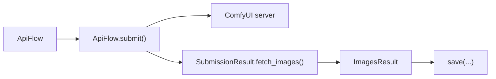
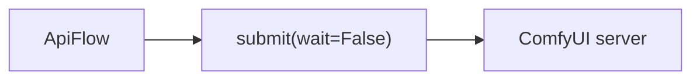
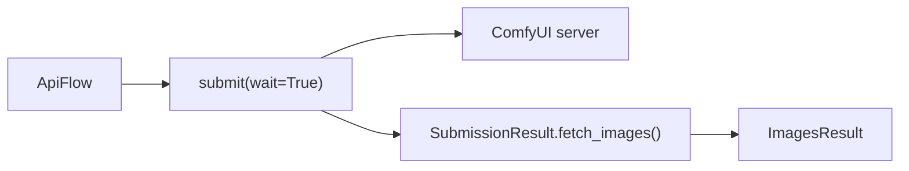

# Submit + images

## Note for ComfyUI Node Developers

Only **registered outputs** can be accessed via `autoflow`.

- ComfyUI tracks outputs per prompt execution
- Nodes must return structured metadata describing what they produced
- This metadata is stored in ComfyUI's execution history (not inferred from folders)

Registered outputs include: images, gifs, videos, audio, text files.

These become:
- viewable via `/view?filename=...`
- visible in the UI
- accessible via `/history`

**Simply saving a file is not enough** — the node must *return output descriptors*.

---

## Overview

Once you have an `ApiFlow`, submit it to ComfyUI and fetch images.



## Submit (no waiting)

Fire-and-forget: submit the workflow and get a job handle back.



```python
# api
from autoflow import Workflow

api = Workflow("workflow.json", object_info="object_info.json")
res = api.submit(server_url="http://localhost:8188", wait=False)
print(res.prompt_id)  # job handle
```

```bash
# cli
# No-wait mode (prints prompt_id and exits)
python -m autoflow --submit --input-path workflow.json --server-url http://localhost:8188 --no-wait

# Wait + save images (prints prompt_id, then written paths). Progress logs go to stderr.
python -m autoflow --submit --input-path workflow.json --server-url http://localhost:8188 --save-images outputs_submit_images --filepattern frame.###.png --index-offset 1001

# Wait + save registered files (prints prompt_id, then written paths).
# Use --output-types to narrow. (The default sample workflow reliably produces \"images\".)
python -m autoflow --submit --input-path workflow.json --server-url http://localhost:8188 --save-files outputs_submit_files --output-types images
```

## Wait + fetch images

Wait for completion then fetch output images.



```python
# api
from autoflow import Workflow

api = Workflow("workflow.json", object_info="object_info.json")
res = api.submit(server_url="http://localhost:8188", wait=True)
images = res.fetch_images()
images.save("outputs/frame.###.png")
```

## Inline image fetch with submit

Use `fetch_outputs=True` to fetch images during submit (saves an extra call).

```python
# api
from autoflow import Workflow

api = Workflow("workflow.json", object_info="object_info.json")
res = api.submit(
    server_url="http://localhost:8188",
    wait=True,
    fetch_outputs=True,
    include_bytes=True,
)
# res["images"] is already populated
```

## Timeouts explained

| Parameter | Default | Description |
|-----------|---------|-------------|
| `timeout` | 30 | HTTP request timeout (each individual request) |
| `wait_timeout` | 60 | Total time to wait for job completion (polling `/history`) |
| `poll_interval` | 0.5 | Seconds between `/history` polls |

WebSocket idle timeout:
- `AUTOFLOW_WS_IDLE_TIMEOUT_S` (default 5s) prevents hangs when the WS is silent and falls back to `/history`.

```python
# api
from autoflow import Workflow

api = Workflow("workflow.json", object_info="object_info.json")
res = api.submit(
    server_url="http://localhost:8188",
    wait=True,
    timeout=30,        # each HTTP request times out after 30s
    wait_timeout=300,  # wait up to 5 minutes for job to finish
    poll_interval=1.0, # poll every second
)
```

## Save patterns

### Directory mode
If target is a directory, files retain ComfyUI's rendered filenames.

```python
# api
# Offline-friendly demo ImagesResult (uses the local output.png from docs-test sandbox)
from pathlib import Path
from autoflow import ImagesResult, ImageResult

png_bytes = Path("output.png").read_bytes()
images = ImagesResult(
    [
        ImageResult(
            {
                "ref": {"filename": "ComfyUI_00001_.png", "subfolder": "", "type": "output"},
                "bytes": png_bytes,
            }
        )
    ]
)

images.save("outputs")
# -> outputs/ComfyUI_00001_.png, outputs/ComfyUI_00002_.png, ...
```

### Pattern mode
If target contains `#` placeholders, each image gets a numbered filename.

```python
# api
# Offline-friendly demo ImagesResult (uses the local output.png from docs-test sandbox)
from pathlib import Path
from autoflow import ImagesResult, ImageResult

png_bytes = Path("output.png").read_bytes()
images = ImagesResult(
    [
        ImageResult({"ref": {"filename": "ComfyUI_00001_.png", "subfolder": "", "type": "output"}, "bytes": png_bytes}),
        ImageResult({"ref": {"filename": "ComfyUI_00002_.png", "subfolder": "", "type": "output"}, "bytes": png_bytes}),
    ]
)

images.save("outputs/frame.###.png")
# -> outputs/frame.000.png, outputs/frame.001.png, ...

images.save("outputs/frame.####.png", index_offset=1001)
# -> outputs/frame.1001.png, outputs/frame.1002.png, ...
```

### `{src_frame}` token

If you want to carry ComfyUI's original frame number (best-effort parsed from the ref/filename), use `{src_frame}` in a filename template.

```python
# api
# If ComfyUI saved: frame_0042.png, frame_0043.png
from pathlib import Path
from autoflow import ImagesResult, ImageResult

png_bytes = Path("output.png").read_bytes()
images = ImagesResult(
    [
        ImageResult({"ref": {"filename": "frame_0042.png", "subfolder": "", "type": "output"}, "bytes": png_bytes}),
        ImageResult({"ref": {"filename": "frame_0043.png", "subfolder": "", "type": "output"}, "bytes": png_bytes}),
    ]
)
images.save("outputs", filename="render.{src_frame}.png")
# -> outputs/render.42.png, outputs/render.43.png
```

If you want padding, you can use Python's format specifiers **when `{src_frame}` is present**:

```python
# api
from pathlib import Path
from autoflow import ImagesResult, ImageResult

png_bytes = Path("output.png").read_bytes()
images = ImagesResult(
    [
        ImageResult({"ref": {"filename": "frame_0042.png", "subfolder": "", "type": "output"}, "bytes": png_bytes}),
        ImageResult({"ref": {"filename": "frame_0043.png", "subfolder": "", "type": "output"}, "bytes": png_bytes}),
    ]
)
images.save("outputs", filename="render.{src_frame:03d}.png")
# -> outputs/render.042.png, outputs/render.043.png
```

## Decode image pixels (Pillow required)

`ImageResult.to_pixels()` decodes image bytes into raw pixel data.

```python
# api
from autoflow import Workflow

api = Workflow("workflow.json", object_info="object_info.json")
res = api.submit(server_url="http://localhost:8188", wait=True)
images = res.fetch_images(include_bytes=True)

for img in images:
    pixels = img.to_pixels(mode="RGB")
    # pixels = {"mode": "RGB", "size": (w, h), "pixels": bytes}
    print(f"Image size: {pixels['size']}")

    # Or as a Python list (slower, bigger):
    pixels = img.to_pixels(mode="RGBA", as_list=True)
    # pixels["pixels"] is now a list of (r, g, b, a) tuples
```

## Transcoding with Pillow / ImageMagick / ffmpeg

### Pillow (format conversion)

Save in a different format by using a different extension (requires Pillow).

```python
# api
# ComfyUI outputs PNG, save as JPEG
# This requires Pillow to actually run; keep as a copy/paste example.
from autoflow import ImagesResult, ImageResult
from pathlib import Path

png_bytes = Path("output.png").read_bytes()
images = ImagesResult([ImageResult({"ref": {"filename": "ComfyUI_00001_.png", "subfolder": "", "type": "output"}, "bytes": png_bytes})])

if False:  # docs-test: optional dependency
    images.save("outputs/frame.###.jpg")
# Pillow converts PNG -> JPEG automatically (when installed)
```

### ImageMagick / ffmpeg (optional)

For advanced conversions, pass paths to external tools.

```python
# api
# These require external binaries; keep as copy/paste examples.
from autoflow import ImagesResult, ImageResult
from pathlib import Path

png_bytes = Path("output.png").read_bytes()
images = ImagesResult([ImageResult({"ref": {"filename": "ComfyUI_00001_.png", "subfolder": "", "type": "output"}, "bytes": png_bytes})])

def example_imagemagick(images: ImagesResult) -> None:
    images.save(
        "outputs/frame.###.webp",
        imagemagick_path="/usr/bin/convert",
    )

def example_ffmpeg(images: ImagesResult) -> None:
    images.save(
        "outputs/frame.###.png",
        ffmpeg_path="/usr/bin/ffmpeg",
    )
```

## ImagesResult.save() reference

| Parameter | Type | Description |
|-----------|------|-------------|
| `output_path` | str/Path | Directory or pattern (e.g., `frame.###.png`). Defaults to env `AUTOFLOW_OUTPUT_PATH`, else `./`. |
| `filename` | str | Optional filename template (used when `output_path` is a directory). |
| `regex_parser` | str/`re.Pattern` | Optional regex to parse the source filename and expose named groups as tokens. |
| `overwrite` | bool | Overwrite existing files (default: False) |
| `index_offset` | int | Add offset to frame index (default: 0) |
| `imagemagick_path` | str/Path | Path to ImageMagick `convert` binary |
| `ffmpeg_path` | str/Path | Path to `ffmpeg` binary |

## Related examples

- Console conversion: [`examples/code/console_convert_example.py`](../examples/code/console_convert_example.py)
- FastAPI service: [`examples/code/fastapi_example.py`](../examples/code/fastapi_example.py)

