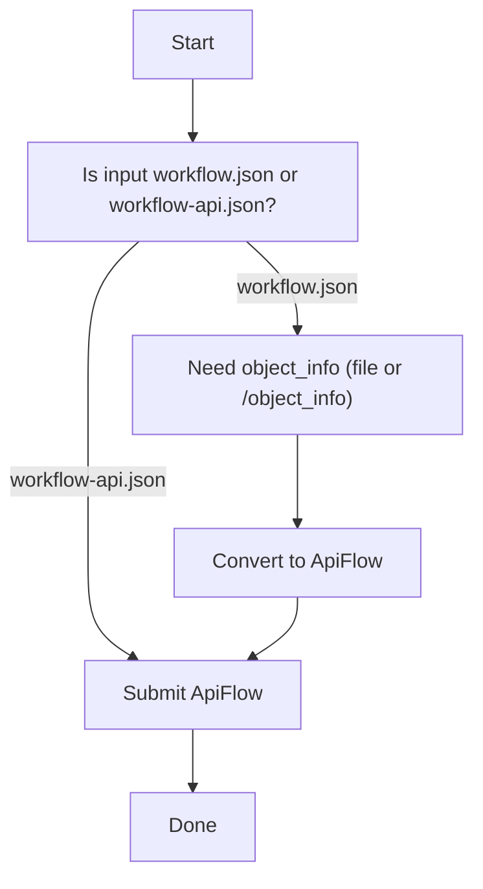

# Troubleshooting



## "Not a ComfyUI workspace workflow.json"
- `Flow` is strict
- required keys:
  - `nodes` (list)
  - `links` (list)
  - `last_node_id`
  - `last_link_id`
- **Possible causes**: You may be passing an `api-format` workflow
  (flat dict of `{node_id: {...}}`) to `Flow` — use `ApiFlow` instead.

## "API payload node missing class_type/inputs"
- `ApiFlow` is strict
- top-level must be: `{"node_id": {"class_type": "...", "inputs": {...}}, ...}`
- Check for nodes with missing `class_type` — can happen if the workflow was
  saved from an older ComfyUI version or a custom exporter.

## "Missing server URL"
- submission requires:
  - `server_url=...` (Python), or
  - `AUTOFLOW_COMFYUI_SERVER_URL` (env var)

## Conversion succeeds but some nodes are skipped

- Use `convert_with_errors()` to see detailed error/warning diagnostics
- Check `ConvertResult.skipped_nodes` — skipped nodes usually mean:
  - Missing entry in `object_info` for the node's `class_type`
  - The node belongs to a custom node pack not present in the object_info

```python
result = autoflow.convert_workflow_with_errors(workflow)
print(result)  # e.g. ConvertResult(ok=True, errors=0, warnings=2, nodes=12/14)
for w in result.warnings:
    print(w)
```

## Submission hangs or times out

- Verify ComfyUI is reachable: `curl http://127.0.0.1:8188/system_stats`
- Check that `server_url` includes the port (default: `8188`)
- If behind a reverse proxy, ensure WebSocket upgrade is allowed
  (autoflow uses WebSocket for real-time progress events)
- Pass `wait=False` to `submit()` to fire-and-forget without blocking

## Connection refused / network errors

- ComfyUI may not be running or is on a different host/port
- `autoflow.comfyui_available()` can probe the server before submitting:
  ```python
  if autoflow.comfyui_available(server_url="http://localhost:8188"):
      result = api_flow.submit(server_url="http://localhost:8188")
  ```
