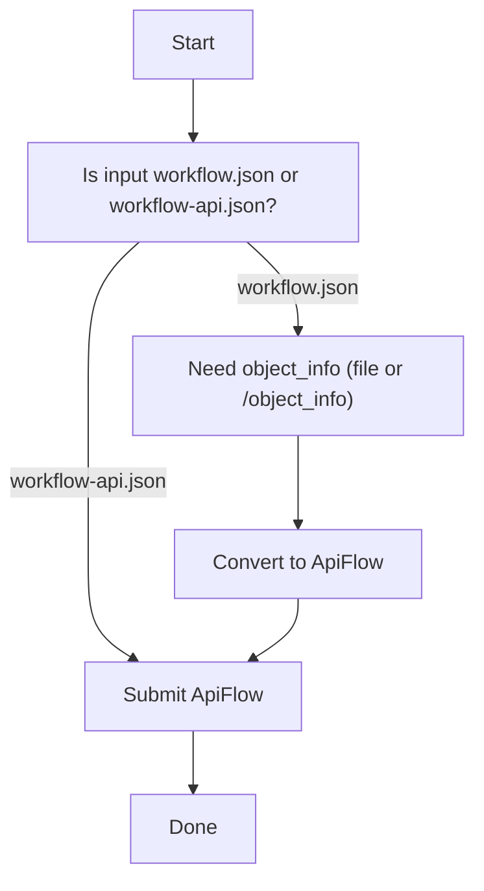

# Troubleshooting

## “Not a ComfyUI workspace workflow.json”
- `Flow` is strict
- required keys:
  - `nodes` (list)
  - `links` (list)
  - `last_node_id`
  - `last_link_id`

## "API payload node missing class_type/inputs"
- `ApiFlow` is strict
- top-level must be: `{"node_id": {"class_type": "...", "inputs": {...}}, ...}`

## “Missing server URL”
- submission requires:
  - `server_url=...` (Python), or
  - `AUTOFLOW_COMFYUI_SERVER_URL` (env var)

